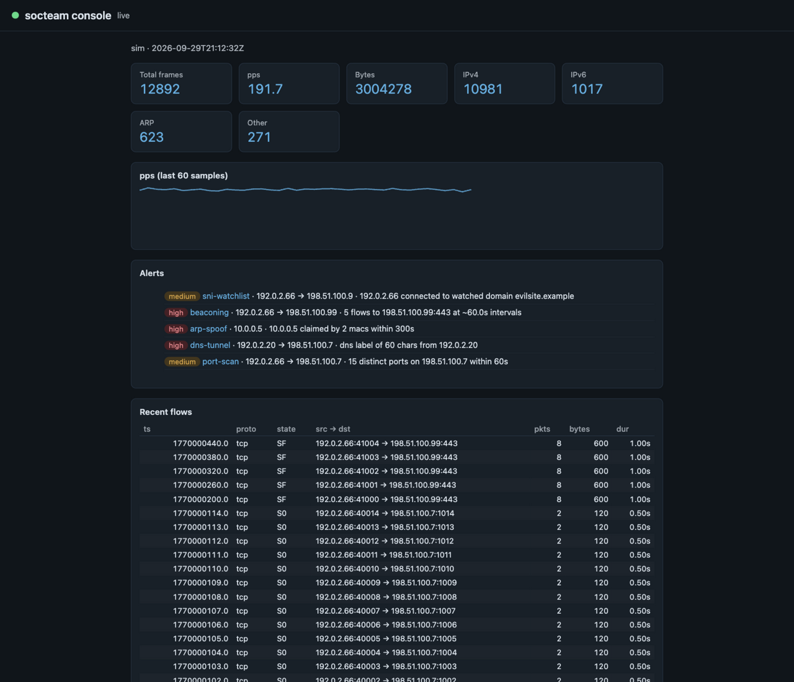

# socteam

A local SOC for your own private network: a passive traffic sensor, a
detection engine, and a live web console that run fully on-prem — small
enough for a Raspberry Pi, no cloud anywhere.

```
                 ┌──────────────────────────────────────────┐
 frames ──────►  │ sensor: capture → parse L2–L7 → flows    │
 (NIC/pcap/sim)  │         → Zeek-style NDJSON events       │
                 └──────────────────────┬───────────────────┘
                                        ▼
                 ┌──────────────────────────────────────────┐
                 │ store: in-memory + optional DuckDB       │
                 │ detect: port scan, beaconing, DNS tunnel,│
                 │         ARP spoof, SNI watchlist         │
                 └──────────────┬─────────────┬─────────────┘
                                ▼             ▼
                 ┌──────────────────┐  ┌────────────────┐
                 │ ctl: status,     │  │ console: live  │
                 │ flows, alerts,   │  │ stats, flows,  │
                 │ detect, tail     │  │ alert feed     │
                 └──────────────────┘  └────────────────┘
```

> Status: the passive sensor core and the first detection set are done —
> capture, protocol parsing (DNS/HTTP/TLS/ARP), a bidirectional flow
> table, NDJSON event output, an in-memory + DuckDB store, five working
> detections with purple-team tests, and a live web console. Next up per
> [PLAN.md](PLAN.md): device inventory, YAML rules, benchmark soak gates,
> then the inline-enforcement exploration.

## Quickstart

```sh
cargo build --release
```

One-command demo (synthetic traffic with all five attacks embedded —
nothing touches a real network):

```sh
scripts/demo.sh
```

You should see five alerts fire: a port scan, beaconing callbacks, a DNS
tunnel, an ARP spoof, and a TLS connection to a watched server name.
The demo output is deterministic and committed under
[`fixtures/demo`](fixtures/demo) — CI re-runs the detection over it.

Run the detection engine over any sensor events directory:

```sh
cargo run -p ctl -- detect --events DIR --out alerts.ndjson --watchlist watchlist.txt
cargo run -p ctl -- alerts --events DIR
cargo run -p ctl -- flows --events DIR --last 10m
cargo run -p ctl -- alerts --events DIR --json     # one JSON object per line
```

Live console (counter tiles, pps sparkline, recent flows, alert feed):

```sh
cargo run -p socteam-console -- --simulate --events DIR --alerts-file alerts.ndjson
```



Capture real traffic (needs root to open the link layer; use your own
network only):

```sh
cargo run -p sensor -- --list-ifaces
sudo cargo run --release -p sensor -- --iface en0 --events DIR
```

`--simulate` runs a deterministic synthetic source instead (no root);
`--pcap FILE` replays a capture. The sensor writes Zeek-inspired NDJSON
events (`conn`, `dns`, `ssl`, `http`, `arp`, heartbeats) with rotation.

## Detections

| Name | Catches | Severity |
|---|---|---|
| `port-scan` | 15 ports on one host, or one port across 30 hosts, in 60s | medium |
| `beaconing` | repeated callbacks at near-uniform 10s–1h intervals | high |
| `dns-tunnel` | >45-char query labels, or TXT query floods | high |
| `arp-spoof` | one IP claimed by dueling MACs; gratuitous-ARP storms | high |
| `sni-watchlist` | TLS to operator-listed server names (metadata only) | medium |

Every detection is documented — signal, thresholds, tuning knobs, known
limits, and the tests that prove it fires — in
[DETECTIONS.md](DETECTIONS.md). The purple-team suite feeds real synthetic
attack frames through the sensor pipeline and asserts the alert comes out
the other end; the same policy will apply to every future detection.

## Crates

| Crate | Job |
|---|---|
| [`sensor`](crates/sensor) | capture (datalink/pcap/sim), protocol parsing L2–L7, flow table with timeouts, NDJSON events |
| [`detect`](crates/detect) | detection engine + the five built-in rules |
| [`store`](crates/store) | event store: in-memory queries from NDJSON, optional DuckDB backend (`--features duckdb`) |
| [`console`](crates/console) | Axum web console: live counters, pps sparkline, flows, alerts |
| [`ctl`](crates/ctl) | `socteam` CLI: status, flows, alerts, detect, tail, import, demo |

## Design notes

- **Pure core, I/O shell.** Parsing, flow tracking, and detection are
  pure functions over injected timestamps — no panics on hostile input
  (every parser degrades on truncation; string caps bound memory), and
  everything is testable without a network.
- **Events as the seam.** Sensor output is a serde-tagged NDJSON event
  stream; the store, detections, console, and CLI all consume the same
  schema, so any component can be replayed offline from the files.
- **Storage.** The default in-memory store queries NDJSON directly; the
  DuckDB backend (`cargo build -p ctl --features duckdb`, then
  `socteam import --events DIR --db FILE` and
  `socteam flows --store duckdb --db FILE`) persists events with SQL-side
  filtering. It stays default-off because the vendored C++ engine is a
  cross-compile hazard for aarch64/Pi builds.
- **Performance.** Criterion benches live in `crates/sensor/benches` and
  `crates/store/benches`. On a dev M-series laptop, the pipeline folds a
  parsed DNS frame in ~0.9 µs and a TCP SYN in ~0.3 µs (single core), and
  a filtered flow query over 10k stored events runs in ~25 µs. The
  Pi-scale soak gate (≥1 Mpps, zero drops) is still an open Phase-1 gate,
  not a claim.

## Docs

- [PLAN.md](PLAN.md) — vision, phased roadmap, hardware path, risks
- [DEPLOY.md](docs/DEPLOY.md) — homelab appliance guide (hardware choice, mirror port, systemd, ntfy)
- [DETECTIONS.md](DETECTIONS.md) — detection coverage and guarantees
- [docs/field-manual.html](docs/field-manual.html) — engineering decisions,
  diagrams, glossary
- [AGENTS.md](AGENTS.md) — how AI agents are meant to work in this repo

## Privacy & scope

This tool is for networks you own. The sensor records metadata (flow
counts, DNS names, TLS server names) — it does not decrypt TLS or dump
payloads, and every detection works on metadata only. Keep captures off
the repo: all test fixtures are synthetic by policy.

## License

MIT
